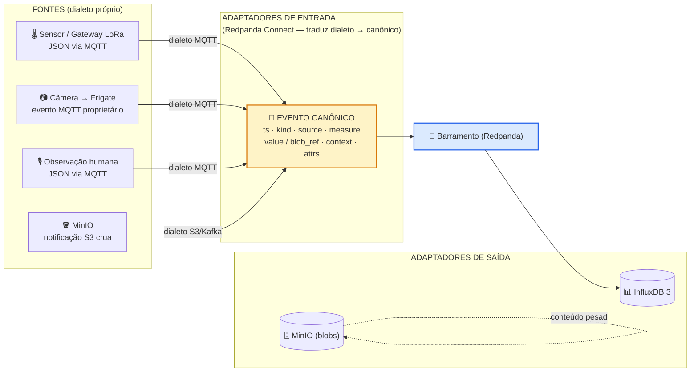
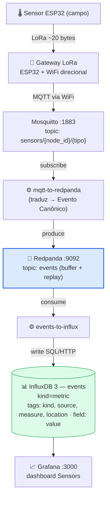
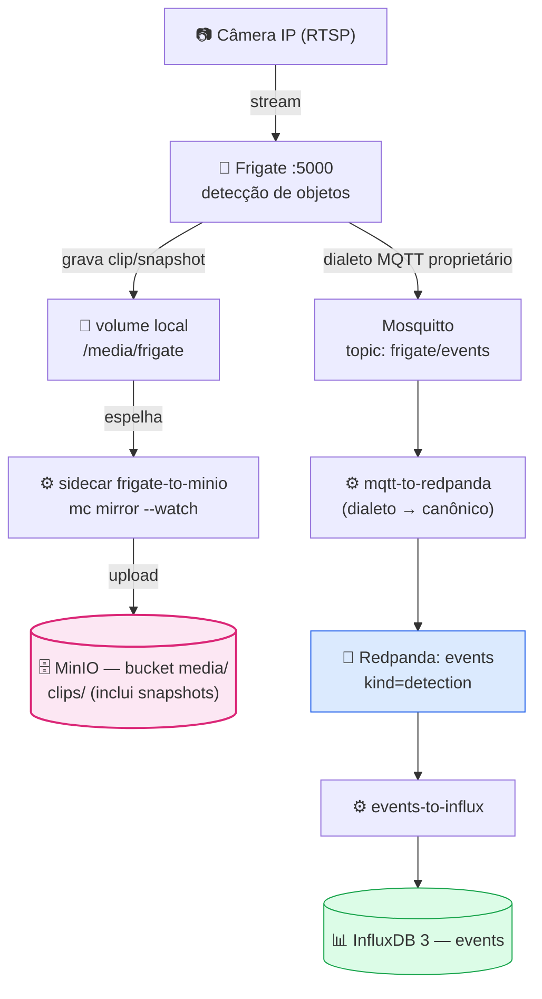
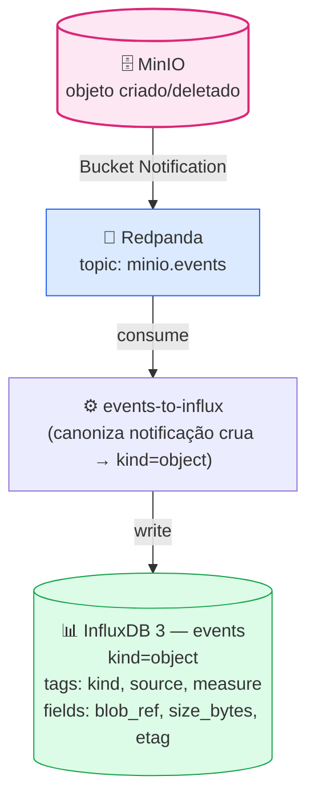
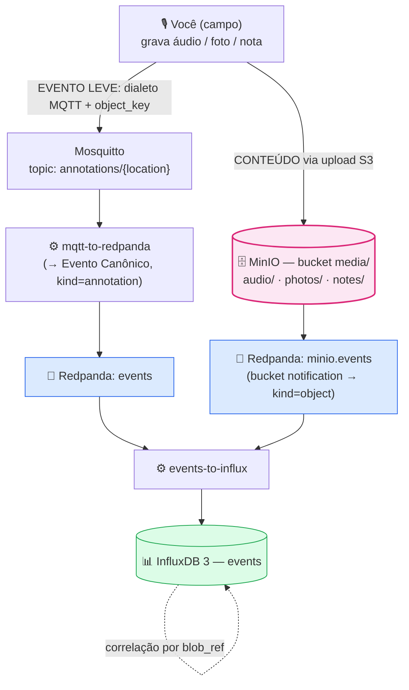

# 5. Fluxos de Dados

Como os dados atravessam o sistema hoje. Onde um fluxo depende de hardware que ainda
não existe no repositório (ESP32/LoRa/gateway, servidor remoto), ele é descrito como a
**interface esperada** — ou seja, o formato que o servidor já sabe processar.

## 5.0 Visão conceitual — Ports & Adapters

Todos os fluxos abaixo compartilham a mesma forma: cada fonte fala o **seu próprio
dialeto** (MQTT do Frigate, JSON do gateway, notificação S3 crua do MinIO). Um
**adaptador de entrada** (pipelines Redpanda Connect) traduz esse dialeto para o
**Evento Canônico**, que trafega pelo **barramento** (Redpanda) e é escrito nos
adaptadores de saída. Trocar uma fonte ou um banco = trocar um adaptador, sem tocar
no núcleo.

> ⚠️ As fontes **não** produzem Evento Canônico — elas emitem seu dialeto. A
> canonização acontece **dentro** dos pipelines Redpanda Connect, não na origem.



> Nota: o conteúdo pesado (clips, fotos, áudio) é escrito no MinIO por quem produz a
> mídia (via sidecar de sync ou upload S3), **não** passa pelo barramento. O que trafega
> no barramento é só o *evento leve* + o `blob_ref` que aponta para o blob.

## 5.1 Fluxo 1 — Sensores (dados leves)

Dados pequenos e frequentes: temperatura, umidade, pH do solo, luminosidade.

```
ESP32 (campo)  →  Gateway LoRa  →  publica MQTT
   [interface esperada: o gateway publica no Mosquitto]
        │
        │ Topic:  sensors/{node_id}/{tipo}
        │ Payload: {"node_id":"n01","type":"temp","value":28.5,"ts":1709827200}
        │          (campo "location" é opcional)
        ▼
Mosquitto (:1883)
        │  subscrito pelo pipeline mqtt-to-redpanda
        ▼
Redpanda topic: events   (Evento Canônico: kind=metric)
        │  consumido pelo pipeline events-to-influx
        ▼
InfluxDB 3 Core  →  measurement: events
        │  tags: kind, source, measure, location  |  field: value
        ▼
Grafana  →  dashboard "Sensors — Overview"
```

**Diagrama (Mermaid):**



> ⚠️ **Contrato não verificado** (upstream do MQTT ainda não integrado — ESP32/LoRa/gateway).
> A parte à esquerda de "publica MQTT" (hardware de campo) ainda não existe. O que já
> funciona é: **qualquer coisa que publique nesse formato MQTT** entra no pipeline e
> chega ao InfluxDB. Veja como testar em [Como Usar](03-usage.md#34-publicar-uma-leitura-de-teste).

## 5.2 Fluxo 2 — Mídia (câmeras)

Clips e snapshots de detecção das câmeras IP.

```
Câmera IP (RTSP)
        │  stream contínuo via rede local
        ▼
Frigate (:5000)
        │  detecção de objetos (pessoas, animais, veículos)
        │  quando detecta:
        ├──▶ grava clip     → volume local /media/frigate  ─┐
        ├──▶ grava snapshot → volume local /media/frigate  ─┤ sidecar
        │                                                   │ frigate-to-minio
        │              (mc mirror --watch)                  ▼ (Frigate não tem backend S3)
        │                                    MinIO (bucket media/, prefixo clips/ — inclui snapshots)
        └──▶ publica evento MQTT → Mosquitto (topic frigate/events)
                 │  payload: {"type":"new|update|end","after":{camera,label,score,...}}
                 ▼
        segue o mesmo caminho do Fluxo 1:
        Mosquitto → mqtt-to-redpanda → Redpanda (events, kind=detection)
                  → events-to-influx → InfluxDB
                 │  measurement: events (eventos "update" são descartados)
```

**Diagrama (Mermaid):**



> A notificação de bucket que o MinIO emite ao receber o clip/snapshot segue o
> **Fluxo 3** (kind=object) — os dois eventos se correlacionam pelo `blob_ref`.

> A cópia dos clips/snapshots do Frigate para o MinIO é feita pelo sidecar
> `scripts/frigate-to-minio.sh`.

## 5.3 Fluxo 3 — Eventos MinIO (bucket notifications)

Sempre que um objeto é criado/deletado no MinIO (por Frigate, upload manual ou script),
o MinIO notifica o Redpanda — **direto no barramento**, não no Redpanda Connect.

> **Por que direto no barramento?** O MinIO tem um produtor Kafka nativo
> (`MINIO_NOTIFY_KAFKA_*` no compose) e escreve a notificação S3 **crua** no topic
> `minio.events` do Redpanda. Diferente dos sensores/câmeras — que passam pelo pipeline
> de entrada `mqtt-to-redpanda` para virar canônicos *antes* do barramento — a
> notificação do MinIO entra crua e só é **canonizada na saída**, quando o
> `events-to-influx` a consome e a transforma em `kind=object`. Ou seja: aqui o
> adaptador de entrada e o de saída são o **mesmo** pipeline (`events-to-influx`), porque
> o próprio MinIO já sabe falar Kafka.

```
Objeto criado/deletado no MinIO
        │  Bucket Notification → Redpanda topic: minio.events
        ▼
pipeline events-to-influx (canoniza a notificação MinIO crua → kind=object)
        │  extrai source (path), measure (content_type), blob_ref, size, etag, timestamp
        ▼
InfluxDB 3 Core  →  measurement: events (kind=object)
        │  tags: kind, source, measure
        │  fields: blob_ref, size_bytes, etag, event_name
```

**Diagrama (Mermaid):**



Assim, cada objeto de mídia fica indexado no InfluxDB, e o link para o objeto pode ser
montado a partir de `bucket` + `object_key`.

## 5.4 Fluxo 4 — Monitoramento da infraestrutura

```
Prometheus (:9090)
        ├── scrape: Node Exporter (:9100)  — CPU, RAM, disco, rede do host
        ├── scrape: cAdvisor              — CPU, RAM, I/O por container
        └── scrape: Redpanda (:9644)      — topics, consumer lag, throughput
                 ▼
        Grafana (:3000) → dashboard "Infrastructure — Overview"
```

## 5.5 Fluxo 5 — Replicação geográfica (interface esperada)

> ⚠️ **Contrato não verificado** (replicação remota ainda não integrada).
> O servidor remoto ainda não faz parte do repositório (`remote/` é um placeholder).
Quando existir, a réplica usará a **Site Replication** nativa do MinIO:

```
MinIO (Servidor Principal)  ──Site Replication (via internet/VPN)──▶  MinIO (Servidor Remoto)
        sincroniza buckets, objetos, políticas e IAM
        funciona como backup geográfico; pode ser promovido em caso de falha
```

## 5.6 Fluxo 6 — Anotações (áudio / foto / texto)

Observações humanas feitas em campo: um áudio ditado, uma foto de uma planta, uma
nota de texto sobre o estado de uma área. É o fluxo que responde *"o quê e por quê"*,
complementando os sensores (que respondem *"quanto"*).

Segue a mesma dualidade da mídia: **o conteúdo vai para o data lake; um evento leve
vai para o barramento**.

```
Você (campo) — grava áudio / tira foto / escreve nota
        │
        ├──▶ CONTEÚDO → MinIO (bucket media/, prefixos audio/ | photos/ | notes/)
        │        │  Bucket Notification → segue o Fluxo 3 (events, kind=object)
        │        ▼
        │    InfluxDB (events, kind=object)  — indexa o objeto por si só
        │
        └──▶ EVENTO LEVE → MQTT topic: annotations/{location}
                 │  Payload: {"ts":..,"location":"talhao-norte","kind":"audio",
                 │            "lat":-30.12345,"lon":-51.98765,"gps_accuracy":4.5,
                 │            "object_key":"audio/2026-07-21/ann-001.opus",
                 │            "summary":"pulgao na goiabeira"}
                 ▼
        Mosquitto → mqtt-to-redpanda → Redpanda (events, kind=annotation)
                  → events-to-influx → InfluxDB
                 │  measurement: events (kind=annotation)
                 │  tags: kind, source, measure(=tipo), location
                 │  fields: blob_ref, lat, lon, gps_accuracy, summary
```

**Diagrama (Mermaid):**



Pontos de design:

  podem ser adicionados como novas tags no futuro. O consumer `events-to-influx.yml`
  **itera dinamicamente** as chaves de `context{}` do Evento Canônico e emite cada uma
  como tag — um novo tipo de contexto entra **sem editar o pipeline**, bastando que o
  publicador o inclua no payload.
- **GPS são fields, nunca tags:** coordenadas têm cardinalidade altíssima (quase únicas
  por ponto); como tags, explodiriam o número de séries. `lat`/`lon`/`gps_accuracy` são
  fields **opcionais** e são **omitidos quando ausentes** (nada de sentinela).
- **`summary`** é um rótulo curto **opcional e fornecido por quem publica**. O sistema
  **nunca** o gera automaticamente (transcrição/descrição seriam específicas de domínio
  e quebrariam a genericidade). O corpo/mídia completo vive sempre no MinIO.
- **Correlação:** como **todos os eventos vivem no mesmo measurement `events`** e
  compartilham timestamp (e escopo via `context`), é possível cruzar uma anotação
  com as leituras de sensores e as fotos do mesmo período/área — por janela de tempo
  no Grafana ou por SQL.
- **Busca por raio (ex.: 30 m de um ponto):** o InfluxDB 3 não tem funções geoespaciais
  nativas, mas dá para (1) pré-filtrar por *bounding box* em SQL sobre `lat`/`lon`
  (~0.00027° ≈ 30 m em latitude; em longitude, dividir por `cos(lat)`) e (2) refinar
  para o círculo exato via Haversine na própria query (DataFusion) ou na aplicação.
  Pontos sem GPS são naturalmente ignorados nessa busca.
- **Enriquecimento futuro (opcional):** transcrever um áudio ou descrever uma foto é um
  passo separado que grava *outra* annotation apontando para o mesmo `object_key`, sem
  contaminar o caminho base de ingestão.
